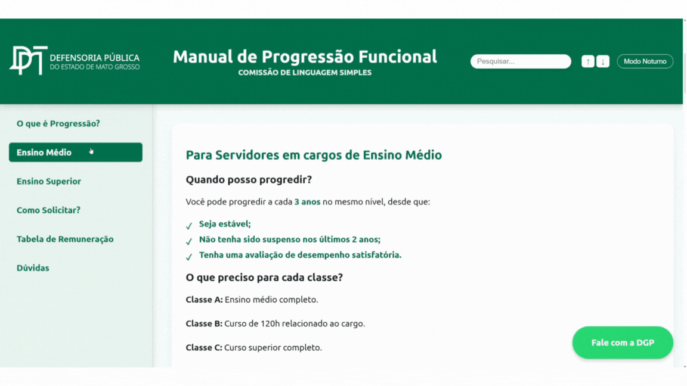
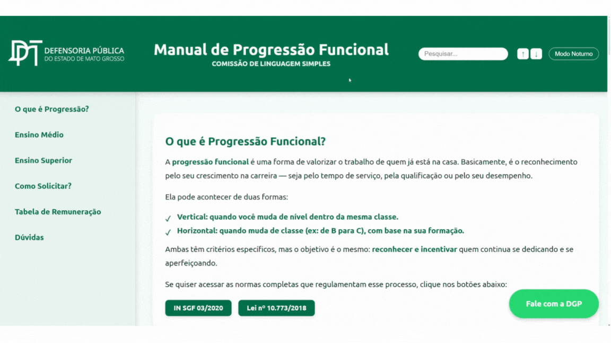
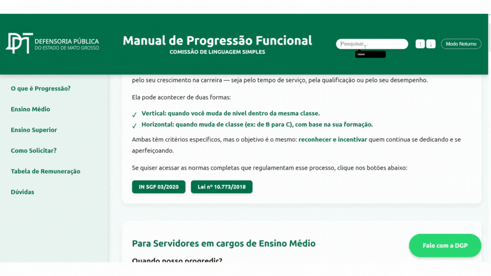
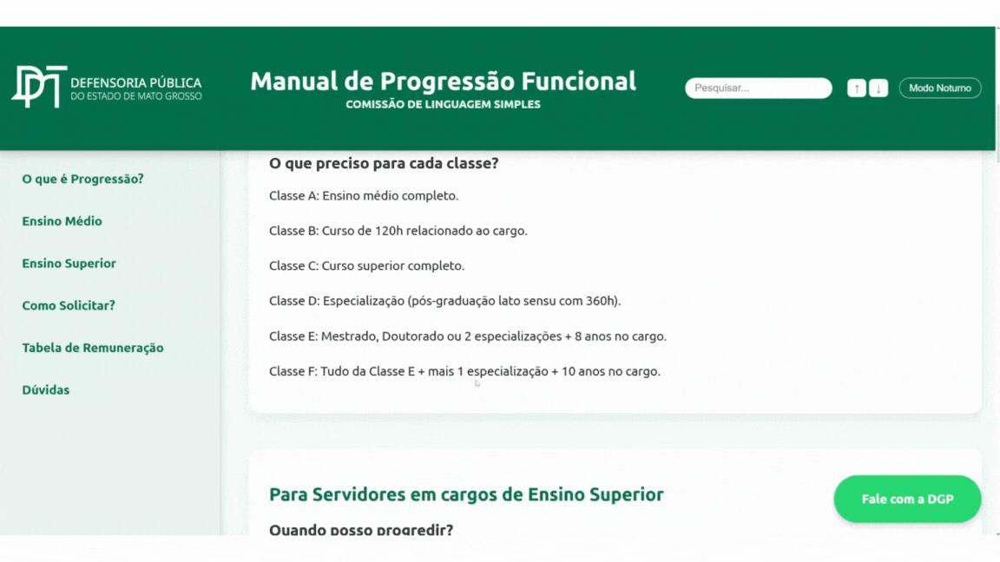
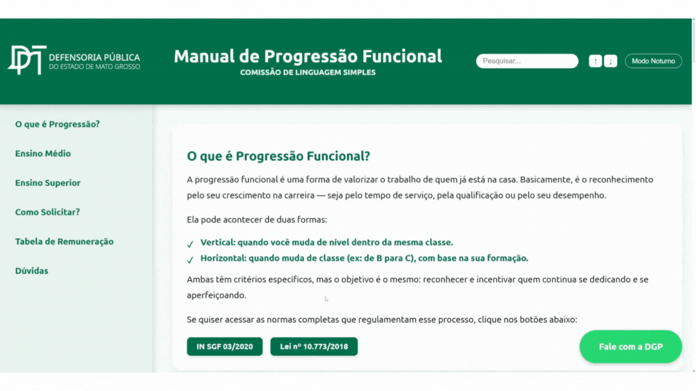
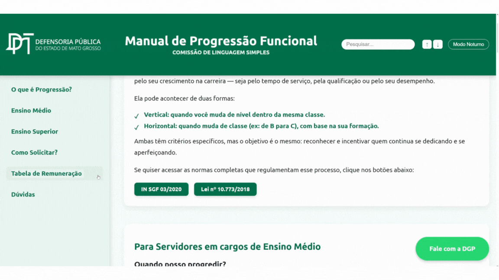
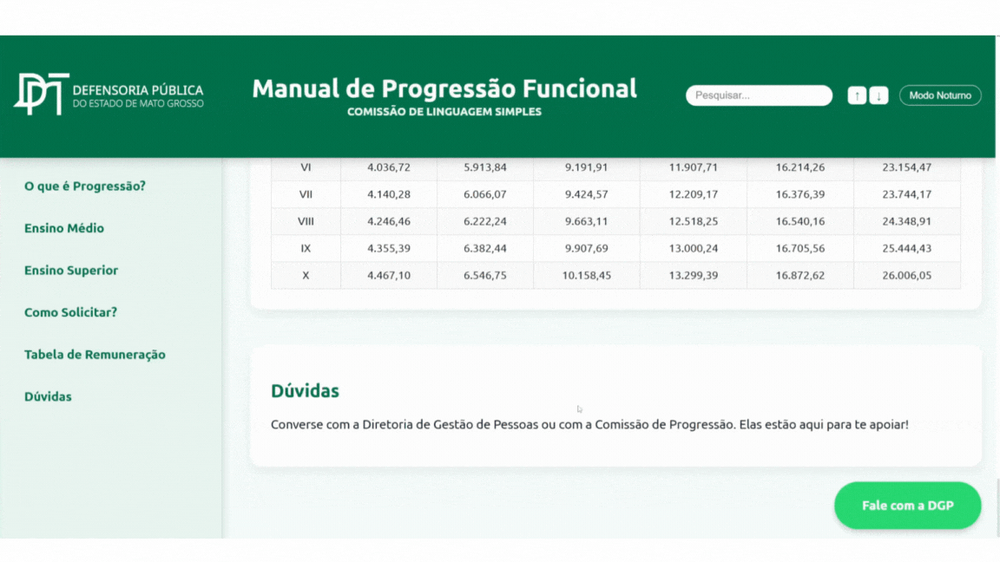

<p align="center">
  
</p>

# 📘 Manual de Progressão Funcional - DPEMT

Este projeto foi desenvolvido com foco no **Grupo de Estudos em Linguagem Simples** da Defensoria Pública do Estado de Mato Grosso (DPEMT).

> Uma aplicação 100% desenvolvida em **Google Apps Script**, com **HTML, CSS e JS puro**, para facilitar a jornada de servidores públicos na progressão funcional.

---

## 🚀 Funcionalidades Demonstradas

### 1. Navegação Fixa e Responsiva via Menu Lateral


### 2. Alternância de Tema: Claro e Escuro


### 3. Pesquisa Interativa com Destaques


### 4. Passo a passo em formato de Carrossel


### 5. Copiar Modelo de Requerimento com Toast de Confirmação


### 6. Tabela de Salários Estilizada e Acessível


### 7. Botão fixo para contato com a Diretoria de Gestão de Pessoas


---

## 📁 Estrutura do Projeto

```
📦 Manual de Progressão
├── Controller.gs         # Backend: controlador de rotas e páginas
├── folder.html           # Frontend: página HTML principal
├── appsscript.json       # Configuração do projeto Apps Script
├── assets/               # Imagens, gifs e recursos estáticos
│   ├── logo-dpemt.png
│   ├── 1.gif ... 7.gif
```

---

## 📌 Tecnologias Utilizadas

- Google Apps Script
- HTML5 / CSS3
- JavaScript Vanilla
- Design Responsivo (mobile-first)
- Integração com planilhas e estrutura modular de pastas

---

## 🧠 Grupo de Estudos em Linguagem Simples

Esse projeto nasceu no Grupo de Estudos em Linguagem Simples da DPE-MT, com a missão de **melhorar a comunicação pública** e tornar mais **acessível e clara** a informação jurídica.

---

## 📬 Contato

Caso tenha dúvidas ou queira contribuir:

- **GitHub**: [zeraiden56](https://github.com/zeraiden56)
- **Instagram**: [@dias.arthurcosta](https://instagram.com/dias.arthurcosta)
- **WhatsApp**: [Fale com a Diretoria de Gestão de Pessoas](https://wa.me/556599545349)

---
